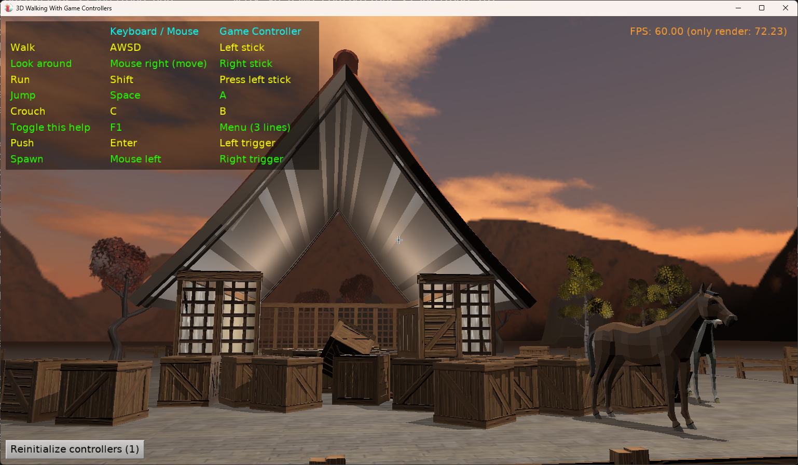
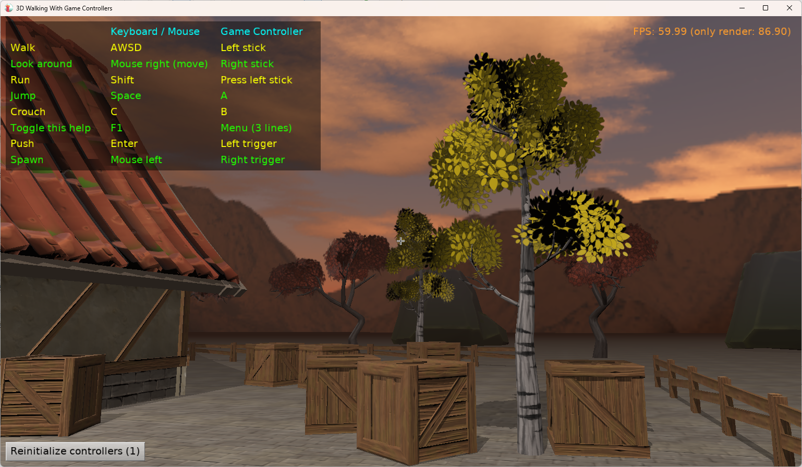

# 3D Walking With Game Controllers

Demo for [Delphi Summit 2025](https://delphisummit.com/)

Show simple 3D level where you can

- walk using game controllers (joystick, gamepad)

- spawn and push with physics.

Using [Castle Game Engine](https://castle-engine.io/).

See [walk_3d_game_controllers](walk_3d_game_controllers/) for the demo application code, data and information how to build.

